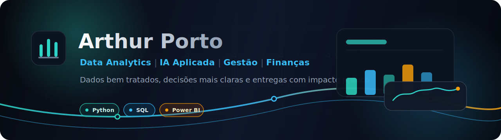

  

<h1 align="center">Arthur Porto</h1>

  <b>Data Analytics | IA aplicada | Gestão | Finanças | Engenharia Civil</b>

  Transformo dados em decisões mais claras, conectando visão de negócio, análise técnica e comunicação executiva.

  <a href="https://github.com/Art-Porto/data-portfolio"><b>📊 Portfólio de Dados</b></a>
  ·
  <a href="https://www.linkedin.com/in/arthursporto/"><b>💼 LinkedIn</b></a>
  ·
  <a href="mailto:arthursporto@gmail.com"><b>✉️ E-mail</b></a>

  
  
  
  
  

---

## 👋 Sobre mim

Sou engenheiro civil com experiência em gestão de empreendimentos, administração e tomada de decisão orientada por indicadores. Hoje estou direcionando essa base para Data Analytics e IA aplicada, com foco em projetos que aproximam dados, negócio e impacto prático.

Atualmente curso Pós-Graduação em Data Analytics pela FIAP e desenvolvo um portfólio técnico com análises reprodutíveis, notebooks organizados, visualizações e entregáveis executivos.

Meus principais interesses estão em:

- 📈 Data Analytics aplicado a negócios, saúde, varejo e finanças.
- 🧹 Análise exploratória, tratamento de dados e storytelling com dados.
- 📊 Dashboards, KPIs e comunicação de resultados para decisão.
- 🤖 IA aplicada para produtividade, automação e apoio analítico.
- 💰 Modelagem financeira, performance empresarial e eficiência operacional.

> Meu objetivo é unir pensamento analítico, contexto de negócio e execução técnica para gerar clareza, eficiência e melhores decisões.

---

## 🧰 Stack

| Área | Ferramentas |
| --- | --- |
| Linguagens | Python, SQL, Markdown |
| Análise de dados | pandas, NumPy, SciPy |
| Machine Learning | scikit-learn, XGBoost, LightGBM, CatBoost |
| Visualização e BI | matplotlib, seaborn, Plotly, Power BI, Looker Studio |
| Notebooks e dev | Jupyter, VS Code, Git, GitHub |
| Dados e arquivos | CSV, Excel, JSON, XML, HTML, SQL |

---

## 📌 Portfólio em destaque

Repositório principal: [`data-portfolio`](https://github.com/Art-Porto/data-portfolio)

| Projeto / pasta | O que contém | Status |
| --- | --- | --- |
| [`fiap`](https://github.com/Art-Porto/data-portfolio/tree/main/fiap) | Estudos e projetos da Pós Tech FIAP, incluindo análises exploratórias e Tech Challenge. | 🚧 Em evolução |
| [`alura`](https://github.com/Art-Porto/data-portfolio/tree/main/alura) | Trilha de Python para Data Science, com fundamentos, NumPy, Pandas, I/O e agrupamentos. | 📚 Em estudo |
| [`google-data-analytics`](https://github.com/Art-Porto/data-portfolio/tree/main/google-data-analytics) | Organização dos estudos do certificado Google Data Analytics. | 🗂️ Em organização |
| [`docs`](https://github.com/Art-Porto/data-portfolio/tree/main/docs) | Materiais auxiliares, prompts e documentos de apoio ao aprendizado. | ✅ Ativo |

> Projetos com dados sensíveis (clientes, fornecedores ou financeiros pessoais) são desenvolvidos em repositório privado para preservar a privacidade dos envolvidos. Disponíveis sob solicitação para fins de avaliação.

O que busco deixar claro em cada projeto:

- problema de negócio ou pergunta analítica;
- dados utilizados e principais tratamentos;
- abordagem técnica e premissas;
- visualizações, resultados e insights;
- próximos passos e oportunidades de melhoria.

---

## 📊 GitHub em números

  
  

  

---

## 🧭 Como trabalho

- **Problema antes da ferramenta:** começo entendendo a decisão que os dados precisam apoiar.
- **Organização e reprodutibilidade:** mantenho notebooks, bases e entregáveis com estrutura clara.
- **Análise com contexto:** combino métricas, visualizações e interpretação de negócio.
- **Entrega executiva:** traduzo achados técnicos em recomendações práticas.
- **Aprendizado contínuo:** documento estudos, comparo abordagens e evoluo os projetos por iteração.

---

## 🎯 No momento estou focado em

- Consolidar projetos de Data Analytics no [`data-portfolio`](https://github.com/Art-Porto/data-portfolio).
- Construir pipelines reprodutíveis (raw → interim → processed) com validação automatizada.
- Comparar abordagens de IA aplicada (Claude / Codex) na geração de análises e relatórios executivos.
- Aprofundar Python, Pandas, estatística aplicada, BI e fundamentos de Machine Learning.
- Desenvolver projetos conectados a saúde, varejo, gestão e finanças.

---

## 📬 Contato

- LinkedIn: [linkedin.com/in/arthursporto](https://www.linkedin.com/in/arthursporto/)
- E-mail: [arthursporto@gmail.com](mailto:arthursporto@gmail.com)
